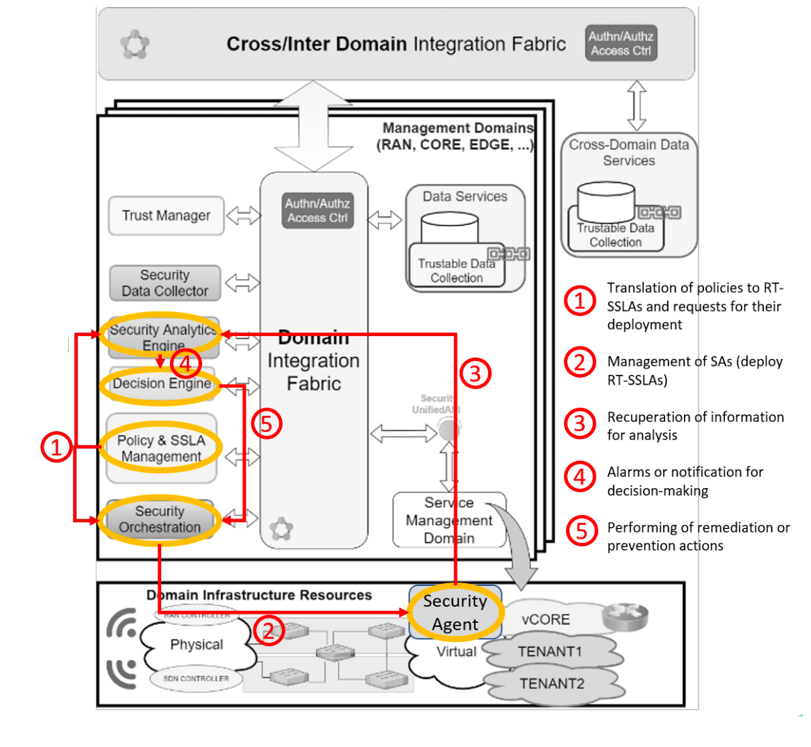
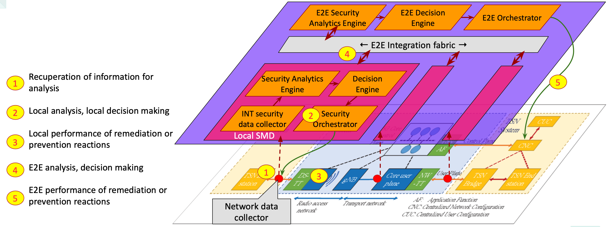

# Security Solution for Deterministic Applications on 6G Networks

This page contains documentations of components in the Montimage's security solution for DetNet6G.

# Objective: Security by design
- Real-time traffic monitoring
- Real-time analysis and reasoning
- Remediation mechanism

# Architecture

- Local & End-to-End Security Management Domains
- Realtime ZSM closed-loop: monitoring – detection – reaction

## High-level Architecture

## An Implementation Architecture for Time-sensitive networks

# Components

Please refer to each component's document for further installation & usage:

- Network data collectors:

   - INT:  https://github.com/montimage/p4-int 
   - Non-disruptive monitoring: https://github.com/montimage/mmt-probe 
- INT data collector:  https://github.com/montimage/mmt-probe/tree/int-collector 
- Security Analytics Engine: https://github.com/montimage/mmt-operator 
- Decision Engine: https://github.com/montimage/det6g-secu-framework 
- Security Orchestrator: https://github.com/montimage/security-orchestrator 
- E2E Integration Fabric: https://kafka.apache.org 

